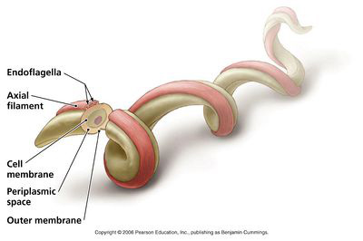

```{r load packages and data}
library(dplyr)
library(knitr)
library(rentrez)
library(stringr)
library(ggplot2)
library(plyr)

mydata <- read.csv("Sequences.csv") # load sequences file
head(mydata)
```

#Print each sequence

##HQ433692.1
```{r print HQ433692.1}
paste(mydata$Sequences[1])
```

##HQ433694.1
```{r print HQ433694.1}
paste(mydata$Sequences[2])
```

##HQ433691.1
```{r print HQ433691.1}
paste(mydata$Sequences[3])
```

# Count the number of each base pair for each sequence
```{r base pair count}
# create a column for each base pair
mydata$num.a <- str_count(mydata$Sequences, "A")
mydata$num.t <- str_count(mydata$Sequences, "T")
mydata$num.g <- str_count(mydata$Sequences, "G")
mydata$num.c <- str_count(mydata$Sequences, "C")

bptable <- kable(select(mydata, -Sequences))
print(bptable)
```

# Calculating GC content
```{r gc content}
# calculating gc % for each sequence
for (i in 1:length(mydata$Sequences)) {
  mydata$GCcontent <- ((mydata$num.c[i] + mydata$num.g[i])/nchar(as.character(mydata$Sequences))[i] * 100) 
}

GCtable <- kable(select(mydata, X, GCcontent)) # table depicting gc content
print(GCtable)
```

# GC content scatterplot
```{r}
GC <- read.csv("GC_content.csv") # load gc content file

GC$GC_percent <- (GC$G + GC$C) # add %GC column

qplot(x=Species, y=GC_percent, data=GC, ylab="% GC content", #scattterplot for GC content
      colour = Species, size = I(0.5), alpha=I(0.3)) +
  theme_classic()
  
```

Lyme disease bacteria look like this 

Learn more about Borrelia burgdorferi [here](https://en.wikipedia.org/wiki/Borrelia_burgdorferi)

